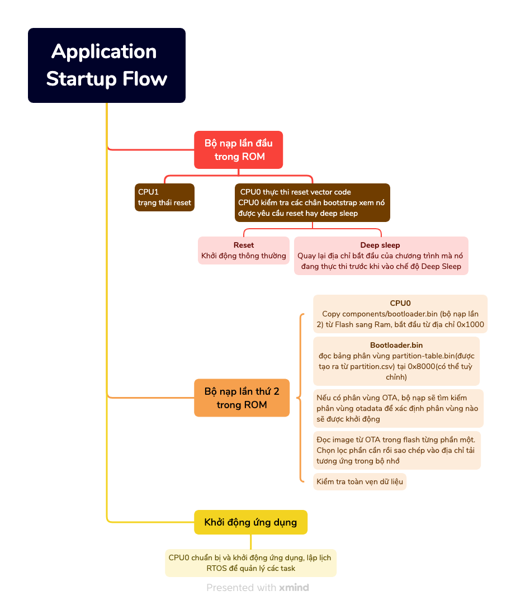
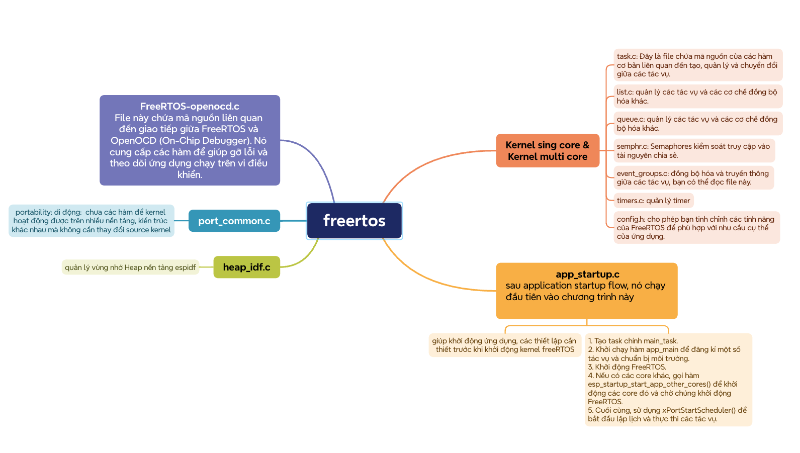

# Blog-ESP32
# A. ESP-IDF

## I. Tại sao lựa chọn ESP32: 

-   Wifi và Bluetooth Low energy
-   Flash và SRAM dồi dào
-   Hỗ trợ I2C, SPI, UART, ADC, DAC, RTC, USB
-   Kích thước nhỏ gọn

## II. Các ví dụ giúp hiểu rõ

### 1. RTC
- esp-idf/examples/peripherals/rtc_timekeeping: Đây là một ví dụ cơ bản về cách sử dụng RTC để theo dõi thời gian thực và hiển thị nó trên màn hình console.
-   esp-idf/examples/system/deep_sleep: Ví dụ này minh họa cách sử dụng RTC để thiết lập báo động và thức tỉnh vi điều khiển từ chế độ Deep-sleep sau một khoảng thời gian nhất định.
-   esp-idf/examples/peripherals/rtc_gpio: Ví dụ này mô tả cách sử dụng RTC để cài đặt báo động trên một chân GPIO cụ thể và thức tỉnh vi điều khiển khi có sự kiện trên chân GPIO.
-   esp-idf/examples/system/time_synced_rtc: Đây là một ví dụ về cách sử dụng RTC để đồng bộ hóa thời gian với một máy chủ NTP (Network Time Protocol) thông qua kết nối Wi-Fi.
### 2. Clock
-   esp-idf/examples/system/rtc: Ví dụ này minh họa cách sử dụng RTC (Real-Time Clock) và các nguồn clock khác nhau, bao gồm dao động crystal bên ngoài, dao động nội, và đồng hồ RTC tích hợp.
-   esp-idf/examples/system/deep_sleep: Trong ví dụ này, ESP32 được đặt vào chế độ Deep Sleep để tiết kiệm năng lượng. Bạn có thể thấy cách cấu hình và sử dụng các nguồn clock khác nhau khi thiết bị chuyển đến và rời khỏi chế độ Deep Sleep.
-   esp-idf/examples/system/rtc_timekeeping: Ví dụ này thể hiện cách sử dụng RTC để theo dõi thời gian thực trong các ứng dụng như đồng hồ, báo động, và ghi nhật ký thời gian.
### 3. Timer Group
-   peripherals/timer gourp
### 4. Bluetooth
-   Bluedroid: Bluedroid là một phần mềm nguồn mở cung cấp giao diện Bluetooth (BT) cho hệ điều hành Android. Nó được sử dụng để triển khai các tính năng Bluetooth trên các thiết bị Android như kết nối, truyền dữ liệu và điều khiển các thiết bị ngoại vi Bluetooth khác.
-   BluFi: BluFi là một công nghệ được phát triển bởi Espressif Systems để cung cấp khả năng cấu hình WiFi thông qua Bluetooth. Với BluFi, bạn có thể cấu hình mạng WiFi trên ESP32 bằng cách sử dụng ứng dụng di động thông qua Bluetooth một cách dễ dàng và thuận tiện.
-   ESP BLE Mesh: ESP BLE Mesh là một framework cho phép xây dựng các mạng mesh (mạng lưới) Bluetooth Low Energy (BLE) trên nền tảng ESP32. Các mạng mesh BLE cho phép các thiết bị trong mạng tương tác với nhau mà không cần điểm trung tâm, mở ra các ứng dụng như điều khiển ánh sáng, cảm biến môi trường và định vị trong nhà.
-   ESP HID Device: HID (Human Interface Device) là một loại thiết bị giao tiếp với người dùng, chẳng hạn như bàn phím, chuột hoặc gamepad. ESP HID Device cho phép ESP32 hoạt động như một thiết bị HID, giúp nó tương tác với các thiết bị đầu cuối người dùng.
-   ESP HID Host: ESP HID Host là một ứng dụng cho phép ESP32 kết nối và tương tác với các thiết bị HID khác như bàn phím hoặc chuột. Nó cho phép ESP32 nhận dữ liệu từ các thiết bị HID và điều khiển chúng.
-   HCI (Host Controller Interface): HCI là một giao diện tiêu chuẩn giữa phần cứng Bluetooth và lớp giao thức Bluetooth trên một thiết bị. Nó đóng vai trò quan trọng trong việc truyền thông giữa bộ điều khiển Bluetooth và các ứng dụng trên thiết bị.
-   NimBLE: NimBLE là một giao diện Bluetooth nguồn mở và dễ sử dụng được phát triển bởi Apache Mynewt. Nó cung cấp một stack Bluetooth Low Energy (BLE) nhẹ và hiệu quả cho các ứng dụng nhúng. NimBLE thường được sử dụng trong các ứng dụng IoT và thiết bị di động.
## III. Ngoại vi

### 1. Digital
-   34 GPIO
-   SPI (SPI, HSPI và VSPI) cho việc truyền thông full-duplex hoặc half-duplex với tốc độ lên đến 80 MHz. SPI cũng hỗ trợ việc kết nối với bộ nhớ flash/SRAM và LCD. Ứng dụng: Giao tiếp với các thiết bị ngoại vi như bộ nhớ flash, màn hình LCD, cảm biến.
-   UART cho việc truyền thông bất đồng bộ với tốc độ lên đến 5 Mbps. Chúng hỗ trợ quản lý phần cứng của tín hiệu CTS và RTS cũng như kiểm soát dòng dữ liệu. Ứng dụng: Giao tiếp với các thiết bị ngoại vi qua chuẩn giao tiếp serial như module Bluetooth, module GSM.
-   I2C Interface : tốc độ lên đến 5 MHz. Chúng hỗ trợ các chế độ tiêu chuẩn và nhanh, cũng như chế độ địa chỉ 7-bit hoặc 10-bit.Giao tiếp với các cảm biến, module cảm ứng thông qua giao diện I2C.
-   I2S Interface: Cung cấp hai giao diện chuẩn I2S cho việc truyền thông full-duplex hoặc half-duplex với tốc độ từ 10 kHz đến 40 MHz. Chúng hỗ trợ các độ phân giải từ 8 đến 64 bit và có hỗ trợ DMA. Ứng dụng: Ghi hoặc phát âm thanh số với chất lượng cao.
-   Remote Control Peripheral: Hỗ trợ việc truyền nhận tín hiệu hồng ngoại với tám kênh và có thể lập trình các dạng sóng. Điều khiển từ xa các thiết bị như máy điều hòa, máy truyền hình.
-   Pulse Counter: Cung cấp bộ đếm xung để bắt xung và đếm cạnh xung.Ứng dụng: Đếm xung từ các cảm biến như cảm biến vị trí hoặc cảm biến vòng quay.
-   LED PWM Controller: Tạo ra 16 kênh sóng kỹ thuật số độc lập với chu kỳ và độ nhấp nháy có thể điều chỉnh.Ứng dụng: Điều khiển độ sáng của đèn LED RGB, điều khiển màu sắc và hiệu ứng ánh sáng.
-   Motor Control PWM: Được sử dụng cho việc điều khiển động cơ kỹ thuật số. Ứng dụng: Điều khiển tốc độ và hướng của động cơ DC hoặc động cơ bước.
-   SD/SDIO/MMC Host Controller: Hỗ trợ giao tiếp với các loại thẻ nhớ như Secure Digital (SD), Multimedia Cards (MMC), và CE-ATA. Ứng dụng: Đọc và ghi dữ liệu từ thẻ nhớ SD, MMC.
-   SDIO/SPI Slave Controller: Chuyển đổi ESP32 thành slave trên bus SDIO hoặc SPI.
-   TWAI® Controller: Hỗ trợ giao tiếp CAN bus theo tiêu chuẩn ISO 11898-1.
-   Ethernet MAC Interface: Cung cấp giao diện MAC Ethernet theo tiêu chuẩn IEEE-802.3-2008.
### 2. Analog
-   Analog-to-Digital Converter (ADC):
-   Ứng dụng: Đo lường các tín hiệu analog như nhiệt độ, độ ẩm, áp suất, cường độ ánh sáng.
Ví dụ: Đọc dữ liệu từ cảm biến nhiệt độ LM35 để giám sát nhiệt độ môi trường.
Digital-to-Analog Converter (DAC):
-   Ứng dụng: Tạo ra các tín hiệu analog như âm thanh, điều khiển độ sáng của đèn LED.
Ví dụ: Phát âm thanh từ ESP32 thông qua DAC để tạo ra âm thanh đa kênh.
Touch Sensor:
-   Ứng dụng: Phát hiện sự chạm hoặc tiếp xúc từ người dùng trên bề mặt cảm ứng.
Ví dụ: Sử dụng các nút cảm ứng để điều khiển các chức năng trên một thiết bị điều khiển từ xa.
#### Bảng Peripheral Pin Configurations - 41-45 : [Peripheral_Pin](https://www.espressif.com/sites/default/files/documentation/esp32_datasheet_en.pdf)
#### Bảng IO_MUX - 63 - [Peripheral_Pin](https://www.espressif.com/sites/default/files/documentation/esp32_datasheet_en.pdf)
## IV. Cách thức hoạt động
### 1. Luồng khi khởi động

**************************************************************************************************************************************************

